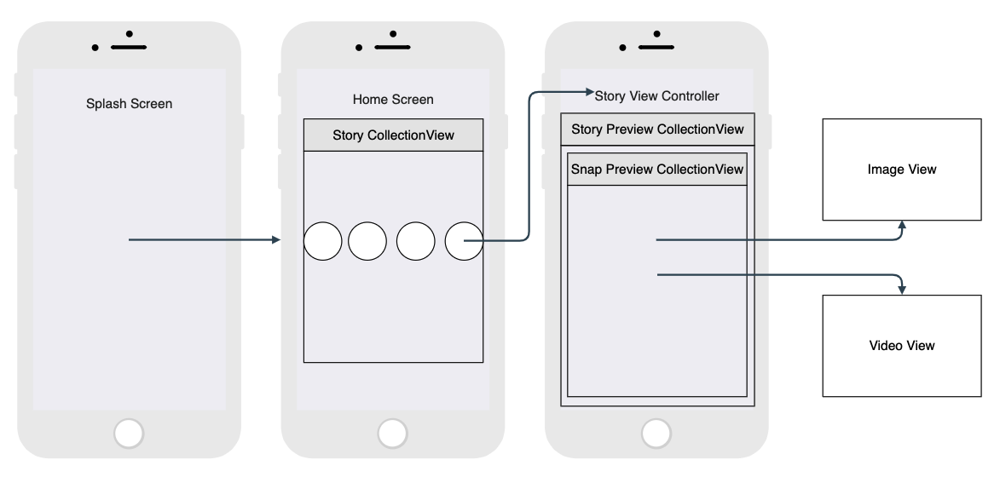
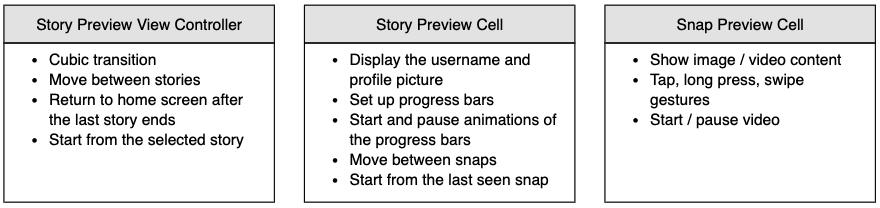
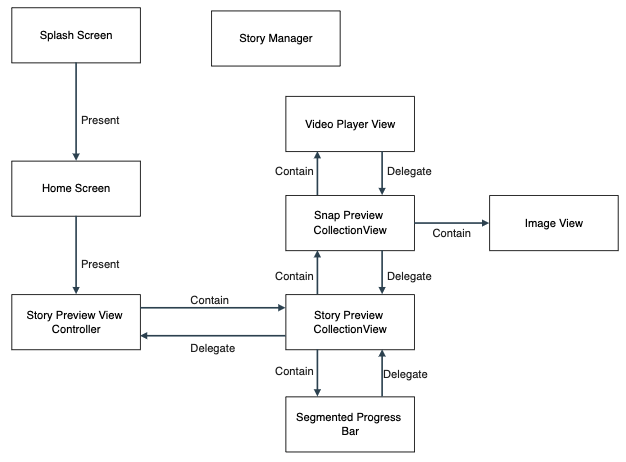

 

  <h1 align="center">IGStories</h1>
  
Simplified Instagram Story screen

## View Hierarchy

While developing this project I chose to use nested `UICollectionView` objects. 
The view hierarchy is explained below:
* The first screen we saw when the app launches is `SplashViewController`.
  - This screen is used to show a logo and lock the orientation of the application to portrait mode only.
* `SplashViewController` waits for 3 seconds and presents the `HomeViewController`.
  - `HomeViewController` contains a `UICollectionView` which contains `HomeViewCell` objects.
  - Each `HomeViewCell` objects contains an image and a label for displaying the corresponding users' usernames and profile pictures.
* When the user selects on the `HomeViewCell` objects, `StoryPreviewViewController` is presented to display the corresponding story and its snaps.
* `StoryPreviewViewContoller` contains a `UICollectionView` which contains `StoryPreviewCell` objects which display related story objects.
* Each `StoryPreviewCell` also contains a `UICollectionView` which contains `SnapPreviewCell` objects which display images and videos of the related snap.

## Data Handling & Data Models

I used a straightforward data modelling concept. Custom models are explained below:
* `IGUser` contains username and profile picture url of the related user.
* `IGSnap` contains media type (video or image) and media url of the related snap.
* `IGStory` contains story id, `IGUser`, snap count, `IGSnap` array and last seen snap index of the related story.
* `IGData` only contains an `IGStory` array.

### StoryManager Object

Instead of passing data between views and controllers, I implemented a manager object which contains all the required data. This objects fetch function
is called in the `AppDelegate`. It contains getter functions for every type of data (snap, story, story array) and a function which is used to update a 
story's last seen snap index.

### igdata.json

This is the mock data file used in this project.

## General Project Structure

The requirements for the story screen are divided between different structures. As you can see below, every structure handles some of the requirements.

Every interior objects notifies its container with delegation. As an example, the following steps are followed for starting a progress bar's animation for a video:
* `VideoPlayerView` registers a KVO (key-value-observer) for `timeControlStatus` variable of the player.
* `VideoPlayerView` gets notified when the video starts by the registered KVO.
* `VideoPlayerView` notifies the `SnapPreviewCell` by delegation.
* `SnapPreviewCell` notifies the `StoryPreviewCell` by delegation.
* `StoryPreviewCell` call the `startAnimating()` function of the related progress bar.

The relationships between structures are also visualized in the below diagram:

[![LinkedIn][linkedin-shield]][linkedin-url]
<!-- MARKDOWN LINKS & IMAGES -->
[linkedin-shield]: https://img.shields.io/badge/-LinkedIn-black.svg?style=for-the-badge&logo=linkedin&colorB=555
[linkedin-url]: https://www.linkedin.com/in/hasan-basri-balaban
